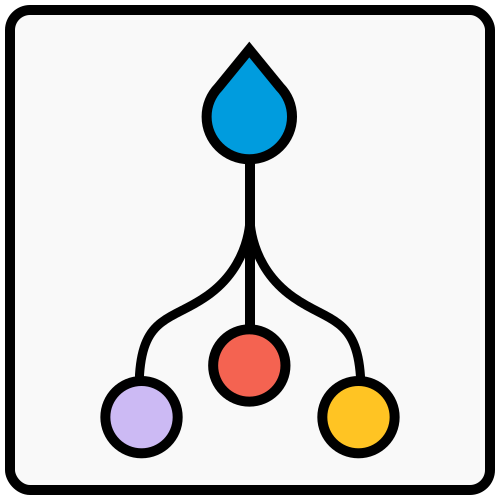
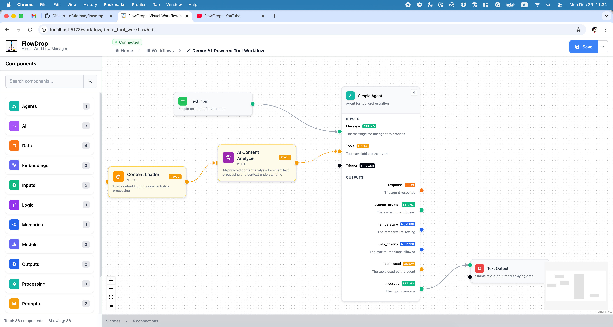
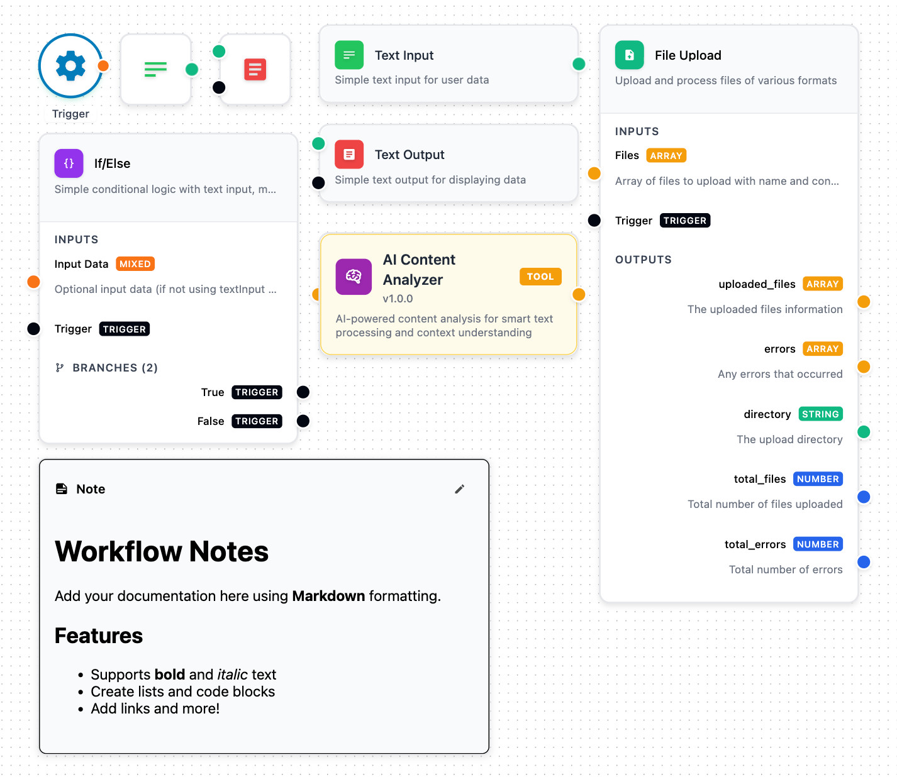

<p align="center">
  
</p>

<h1 align="center">FlowDrop</h1>

<p align="center">
  
  <a href="https://www.npmjs.com/package/@d34dman/flowdrop"></a>
  
  
  <a href="http://npmjs.com/package/@d34dman/flowdrop"></a>
</p>

<p align="center">
  <strong>Build beautiful workflow editors in minutes, not months.</strong>
</p>

<p align="center">
  An awesome workflow editor built with Svelte 5 and @xyflow/svelte.<br/>
  You own the backend. You own the data. You own the orchestration.
</p>

<p align="center">
  <a href="#quickstart">Quickstart</a> •
  <a href="#features">Features</a> •
  <a href="#integration">Integration</a> •
  <a href="#documentation">Docs</a>
</p>

<p align="center">
  
</p>
<p align="center">
  <em>Build AI-powered workflows with drag-and-drop simplicity. Connect nodes, configure inputs/outputs, and visualize your entire pipeline.</em>
</p>

## Why FlowDrop?

Most workflow tools are SaaS platforms that lock you in. Your data lives on their servers. Your execution logic runs in their cloud. You pay per workflow, per user, per run.

**FlowDrop is different.**

FlowDrop is a pure visual editor. You implement the backend. You control the orchestration. Your workflows run on your infrastructure, with your security policies, at your scale.

No vendor lock-in. No data leaving your walls. No surprise bills.

```bash
npm install @d34dman/flowdrop
```

You get a production-ready workflow UI. You keep full control of everything else.

## Quickstart

```svelte
<script lang="ts">
	import { WorkflowEditor } from '@d34dman/flowdrop';
	import '@d34dman/flowdrop/styles/base.css';
</script>

<WorkflowEditor />
```

**5 lines. One fully-functional workflow editor.**

## Features

|                              |                                                                           |
| ---------------------------- | ------------------------------------------------------------------------- |
| 🎨 **Visual Editor Only**    | Pure UI component. No hidden backend, no external dependencies            |
| 🔐 **You Own Everything**    | Your data, your servers, your orchestration logic, your security policies |
| 🔌 **Backend Agnostic**      | Connect to any API: Drupal, Laravel, Express, FastAPI, or your own        |
| 🧩 **7 Built-in Node Types** | From simple icons to complex gateway logic                                |
| 🎭 **Framework Flexible**    | Use as Svelte component or mount into React, Vue, Angular, or vanilla JS  |
| 🐳 **Deploy Anywhere**       | Runtime config means build once, deploy everywhere                        |

## Node Types

FlowDrop ships with 7 beautifully designed node types:

| Type       | Purpose                                 |
| ---------- | --------------------------------------- |
| `default`  | Full-featured nodes with inputs/outputs |
| `simple`   | Compact, space-efficient layout         |
| `square`   | Icon-only minimal design                |
| `tool`     | AI agent tool nodes                     |
| `gateway`  | Conditional branching logic             |
| `terminal` | Start/end workflow points               |
| `note`     | Markdown documentation blocks           |

<p align="center">
  
</p>
<p align="center">
  <em>From simple triggers to complex branching logic, each node type is designed for specific workflow patterns.</em>
</p>

## Integration

### Svelte (Native)

```svelte
<script>
	import { WorkflowEditor, NodeSidebar } from '@d34dman/flowdrop';
</script>

<div class="flex h-screen">
	<NodeSidebar {nodes} />
	<WorkflowEditor {nodes} />
</div>
```

### Vanilla JS / React / Vue / Angular

```javascript
import { mountFlowDropApp, createEndpointConfig } from '@d34dman/flowdrop';

const app = await mountFlowDropApp(document.getElementById('editor'), {
	workflow: myWorkflow,
	endpointConfig: createEndpointConfig('/api/flowdrop'),
	eventHandlers: {
		onDirtyStateChange: (isDirty) => console.log('Unsaved changes:', isDirty),
		onAfterSave: (workflow) => console.log('Saved!', workflow)
	}
});

// Full control over the editor
app.save();
app.getWorkflow();
app.destroy();
```

### Enterprise Integration

```javascript
import { mountFlowDropApp, CallbackAuthProvider } from '@d34dman/flowdrop';

const app = await mountFlowDropApp(container, {
	// Dynamic token refresh
	authProvider: new CallbackAuthProvider({
		getToken: () => authService.getAccessToken(),
		onUnauthorized: () => authService.refreshToken()
	}),

	// Lifecycle hooks
	eventHandlers: {
		onBeforeUnmount: (workflow, isDirty) => {
			if (isDirty) saveDraft(workflow);
		}
	},

	// Auto-save, toasts, and more
	features: {
		autoSaveDraft: true,
		autoSaveDraftInterval: 30000
	}
});
```

## API Configuration

Connect to any backend in seconds:

```typescript
import { createEndpointConfig } from '@d34dman/flowdrop';

const config = createEndpointConfig({
	baseUrl: 'https://api.example.com',
	endpoints: {
		nodes: { list: '/nodes', get: '/nodes/{id}' },
		workflows: {
			list: '/workflows',
			get: '/workflows/{id}',
			create: '/workflows',
			update: '/workflows/{id}',
			execute: '/workflows/{id}/execute'
		}
	},
	auth: { type: 'bearer', token: 'your-token' }
});
```

## Customization

Make it yours with CSS custom properties:

```css
:root {
	--flowdrop-background-color: #0a0a0a;
	--flowdrop-primary-color: #6366f1;
	--flowdrop-border-color: #27272a;
	--flowdrop-text-color: #fafafa;
}
```

## Deploy

### Docker (Recommended)

```bash
cp env.example .env
docker-compose up -d
```

### Node.js

```bash
npm run build
FLOWDROP_API_BASE_URL=http://your-backend/api node build
```

Runtime configuration means you build once and deploy to staging, production, or anywhere else with just environment variables.

## Documentation

| Resource                                                     | Description              |
| ------------------------------------------------------------ | ------------------------ |
| [API Documentation](https://flowdrop-io.github.io/flowdrop/) | REST API specification   |
| [DOCKER.md](./DOCKER.md)                                     | Docker deployment guide  |
| [QUICK_START.md](./QUICK_START.md)                           | Get running in 5 minutes |
| [CHANGELOG.md](./CHANGELOG.md)                               | Version history          |

## Development

```bash
npm install          # Install dependencies
npm run dev          # Start dev server
npm run build        # Build library
npm test             # Run all tests
```

## Contributing

FlowDrop is stabilizing. Contributions will open soon. Star the repo to stay updated.

<p align="center">
  <strong>FlowDrop</strong> - The visual workflow editor you own completely
</p>

<p align="center">
  Built with ❤️ Svelte 5 and @xyflow/svelte
</p>
