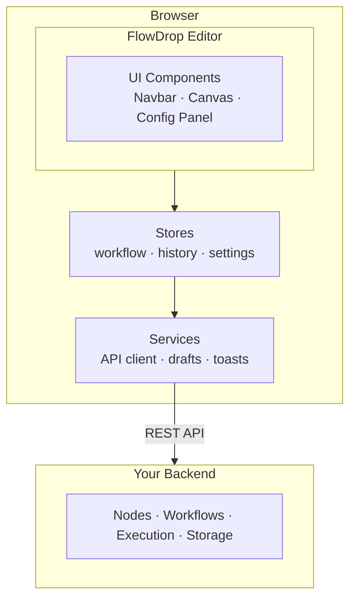
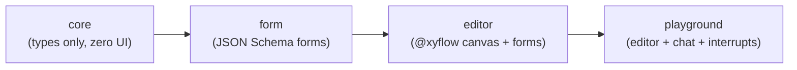
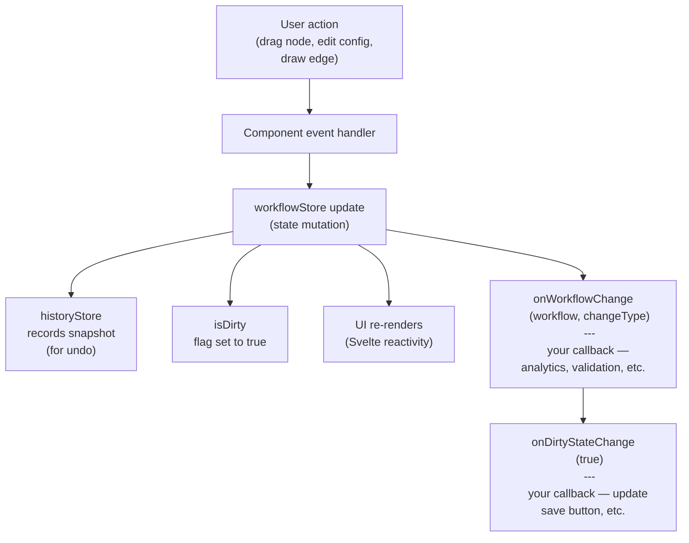
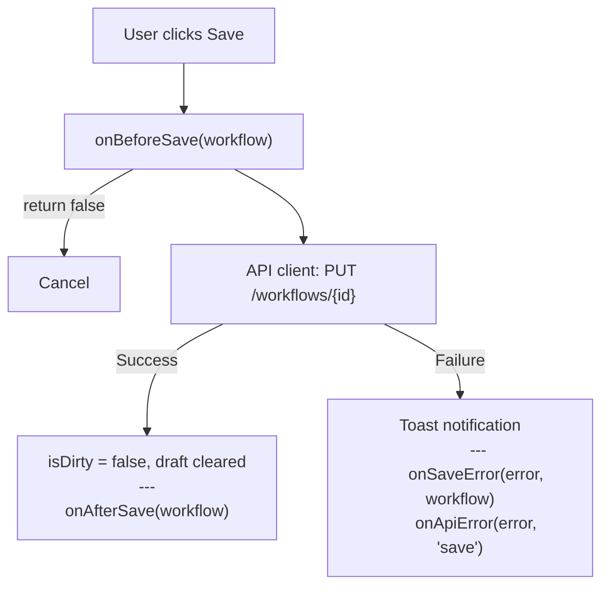

This page explains how FlowDrop is structured internally, so you can make informed decisions about what to import, how to integrate, and where to extend.

## High-Level Architecture

FlowDrop is a **frontend library** that communicates with **your backend** via REST.



## Module Structure

FlowDrop is tree-shakable. Each sub-module has different dependencies and bundle cost:

| Module | What it provides | Heavy deps |
|--------|-----------------|------------|
| `@flowdrop/flowdrop/core` | Types, utilities, auth providers, config helpers | None |
| `@flowdrop/flowdrop/editor` | WorkflowEditor, mount functions, node components | @xyflow/svelte |
| `@flowdrop/flowdrop/form` | SchemaForm, field components | None |
| `@flowdrop/flowdrop/form/code` | Code & template editors | CodeMirror (~300KB) |
| `@flowdrop/flowdrop/form/markdown` | Markdown editor | CodeMirror |
| `@flowdrop/flowdrop/display` | MarkdownDisplay | marked |
| `@flowdrop/flowdrop/playground` | Playground, chat, interrupts | Editor + Form |
| `@flowdrop/flowdrop/settings` | Settings panel, theme toggle | Form |
| `@flowdrop/flowdrop/styles` | CSS design tokens | None |
| `@flowdrop/flowdrop` | Full bundle (everything) | All of the above |

**Dependency chain:**


Import from the most specific module possible to minimize bundle size.

## Component Hierarchy

When you mount `mountFlowDropApp()`, this is the component tree:

```
App
├── Navbar
│   ├── Logo
│   ├── WorkflowName (editable)
│   ├── Save / Export buttons
│   ├── Custom NavbarActions
│   └── ThemeToggle / Settings
├── NodeSidebar
│   ├── Search
│   └── CategoryGroups
│       └── NodeCards (draggable)
├── WorkflowEditor (@xyflow/svelte canvas)
│   ├── Nodes (WorkflowNode, SimpleNode, GatewayNode, etc.)
│   │   └── Ports (input/output handles)
│   ├── Edges (styled by category)
│   └── ConnectionLine
├── ConfigPanel (right side, on node click)
│   ├── NodeHeader (name, type, icon)
│   └── SchemaForm (generated from configSchema)
│       └── FormFields (text, select, code, template, etc.)
└── ToastContainer
```

`mountWorkflowEditor()` mounts just the canvas — no navbar, no sidebar.

## Stores

FlowDrop uses **Svelte 5 runes** for state management. Stores are module-level singletons:

| Store | Purpose | Key state |
|-------|---------|-----------|
| **workflowStore** | Central workflow state | nodes, edges, metadata, isDirty |
| **historyStore** | Undo/redo | past states, future states, canUndo/canRedo |
| **settingsStore** | User preferences | theme, editor behavior, UI config |
| **playgroundStore** | Playground sessions | sessions, messages, isExecuting |
| **interruptStore** | Human-in-the-loop | pending/resolved interrupts |
| **categoriesStore** | Node categories | category definitions, colors |
| **portCoordinateStore** | Handle positions | port coordinates for edge rendering |

:::caution[Single Instance]
FlowDrop uses module-level singleton stores. Only **one FlowDrop editor** can exist per page. Mounting a second instance will share state with the first.
:::

## Services

Services handle communication and side effects:

| Service | Purpose |
|---------|---------|
| **API client** | HTTP requests to your backend (nodes, workflows, execution) |
| **Draft storage** | Auto-save to localStorage |
| **Toast service** | Success/error/loading notifications |
| **Dynamic schema** | Fetch config schemas from API at runtime |
| **Playground service** | Manage sessions, poll for messages |
| **Interrupt service** | Submit interrupt resolutions |
| **History service** | Track and replay state changes |
| **Settings service** | Load/save preferences (localStorage + API) |

## Data Flow

Here's what happens when a user makes a change:



When the user saves:



## Registry System

FlowDrop has two registries for extending the editor:

### Node Component Registry
Register custom Svelte components for new node types:
```typescript
import { registerCustomNode } from '@flowdrop/flowdrop/editor';
registerCustomNode('my-custom-node', MyNodeComponent);
```

### Field Component Registry
Register custom form fields for config schemas:
```typescript
import { registerFieldComponent } from '@flowdrop/flowdrop/form';
registerFieldComponent(matcher, MyFieldComponent, { priority: 10 });
```

Both registries are **singletons** that persist for the page lifetime. Register before or after mounting.

## Next Steps

- [What is a Workflow?](/concepts/what-is-a-workflow/) — the mental model
- [Quick Start](/getting-started/quick-start/) — mount FlowDrop in your app
- [Backend Implementation](/guides/integration/backend-implementation/) — build the API FlowDrop expects
- [Event System](/guides/advanced/event-system/) — hook into every lifecycle event
