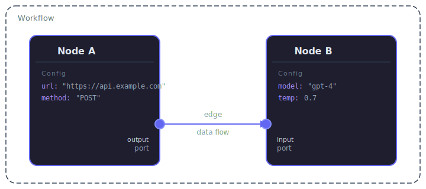
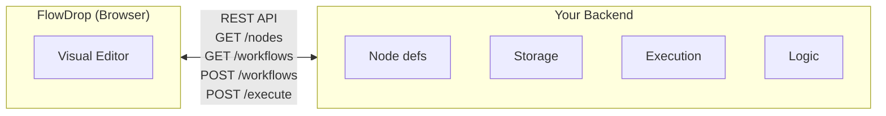

FlowDrop is a **visual workflow editor** — a UI component that lets users build directed graphs of processing steps by dragging, connecting, and configuring nodes on a canvas.

Before diving into code, it's important to understand the mental model.

## The Four Primitives

Every workflow in FlowDrop is built from four core concepts:

### Nodes

A **node** is a single step in the workflow. It represents an action, decision, or data transformation — for example, "Send an HTTP request", "Run an LLM prompt", or "Route based on condition".

Each node has:
- A **type** that determines its visual appearance (default, simple, square, tool, gateway, terminal, idea, note)
- **Metadata** describing its name, icon, category, and capabilities
- **Configuration** — user-editable settings defined by a JSON Schema

### Edges

An **edge** is a connection between two nodes. It defines the flow of data or control from one step to the next.

Edges have **categories** that determine their visual style and semantic meaning:
- **data** — standard data flow (default)
- **trigger** — event-based activation
- **tool** — tool invocation from an agent
- **loopback** — feedback loops

### Ports

A **port** is a typed connection point on a node. Nodes have **input ports** (receiving data) and **output ports** (sending data).

Each port has a **data type** (e.g., `string`, `json`, `file`, `trigger`). FlowDrop enforces **type-safe connections** — you can only connect ports with compatible data types.

### Config

Each node's behavior is controlled by its **configuration** — a set of key-value pairs defined by a [JSON Schema](/guides/config-schema/). For example, an HTTP request node might have config fields for URL, method, headers, and body.

The configuration schema also controls the **form UI** that appears when users click on a node.

## How It All Fits Together

:::note
Each node has typed **ports** (input/output connection points) and **config** (user-editable settings). An **edge** connects an output port to an input port, defining data flow.
:::

A workflow is a **graph**: nodes are the vertices, edges are the connections, ports define where connections attach, and config controls what each node does.

## What FlowDrop Does (and Doesn't Do)

FlowDrop is a **frontend editor**. It handles:

- Visual canvas with drag-and-drop, zoom, pan
- Node palette and sidebar for discovery
- Connection drawing with type-safe port validation
- Configuration forms generated from JSON Schema
- Workflow serialization to JSON
- Undo/redo, auto-save drafts, import/export

FlowDrop does **not** handle:

- **Execution** — It doesn't run your workflows. You need your own backend execution engine.
- **Storage** — It calls your REST API to persist workflows. You provide the database.
- **Business logic** — Node behavior is defined by your backend, not by FlowDrop.

Think of it this way:

> **FlowDrop owns the UI. You own the logic.**

FlowDrop gives users a beautiful way to *design* workflows. Your backend gives those workflows *meaning*.

## The Frontend–Backend Contract

FlowDrop communicates with your backend through a REST API. The contract is simple:

1. **Your backend tells FlowDrop what nodes exist** — by serving node metadata (name, ports, config schema)
2. **Users build workflows visually** — FlowDrop handles all the UI
3. **FlowDrop sends the workflow JSON to your backend** — for storage and execution

For a detailed breakdown of this architecture, see [Architecture Overview](/concepts/architecture-overview/).

## When to Use FlowDrop

FlowDrop is a good fit when you need:

- A **visual, no-code interface** for building multi-step processes
- **AI agent workflows** with branching, tool use, and human-in-the-loop
- **Data pipelines** with configurable transformations
- **Automation builders** where non-technical users define business logic
- **Any application** where users need to compose processing steps visually

## Next Steps

- [Architecture Overview](/concepts/architecture-overview/) — how all the pieces fit together
- [Installation](/getting-started/installation/) — get FlowDrop into your project
- [Tutorial](/tutorial/01-embedding-the-editor/) — build your first workflow editor step by step
