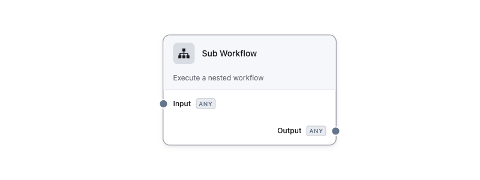
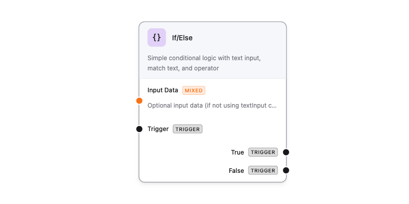
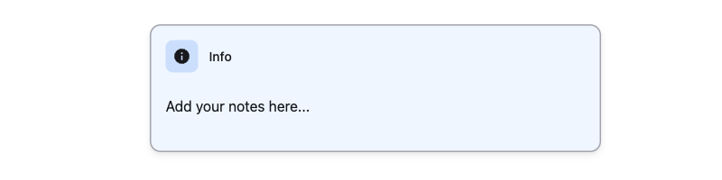

FlowDrop ships with 8 built-in node types, each designed for specific workflow patterns.

## Built-in Types

| Type | Purpose | Description |
|------|---------|-------------|
| `default` | Full-featured nodes | Input/output port lists, icon, label, description |
| `simple` | Compact layout | Header with icon and description, space-efficient |
| `square` | Icon-only | Minimal design for simple operations |
| `tool` | AI agent tools | Tool metadata with badge label |
| `gateway` | Branching logic | Conditional output paths with multiple branches |
| `terminal` | Start/end points | Circular nodes for workflow entry and exit |
| `idea` | Conceptual flow | BPMN-like flow nodes for conceptual diagrams |
| `note` | Documentation | Markdown-enabled sticky notes (no execution) |

For the complete JSON structure, see [Node Structure](/guides/node-json/). For port definitions and data types, see [Port System & Data Types](/guides/port-system/).

### `default`

Full-featured node with input/output port lists, icon, label, and description. Suitable for most workflow steps.

<figure>



<figcaption>A default node showing icon, label, description, and input/output ports with data type badges.</figcaption>
</figure>

### `simple`

Compact layout with header icon and description. Space-efficient for nodes that don't need visible ports.

<figure>


<figcaption>A simple node with compact header, icon, and description — output port visible on the right.</figcaption>
</figure>

### `square`

Icon-only minimal design. Ideal for simple operations where the icon alone conveys the purpose.

<figure>


<figcaption>A square node displaying only an icon — the most compact node type.</figcaption>
</figure>

### `tool`

Designed for AI agent tools. Displays tool metadata including version, badge label, and description.

<figure>


<figcaption>A tool node with version number, TOOL badge, and purple accent border for AI agent tools.</figcaption>
</figure>

### `gateway`

Branching logic node with conditional output paths. Supports multiple branches for routing workflow execution.

<figure>



<figcaption>A gateway node with input ports on the left and conditional True/False branches on the right.</figcaption>
</figure>

### `terminal`

Circular start/end point nodes. Used to mark workflow entry and exit points.

<figure>


<figcaption>A terminal Start node with circular shape and a single output port.</figcaption>
</figure>

### `idea`

Conceptual idea node for BPMN-like flow diagrams. Lightweight node with a colored top border accent.

<figure>


<figcaption>An idea node with colored top border accent, input and output ports for conceptual flow diagrams.</figcaption>
</figure>

### `note`

Markdown-enabled sticky notes for documentation. These are non-executing nodes meant for annotations.

<figure>



<figcaption>A note node with light blue background for adding documentation and annotations to the canvas.</figcaption>
</figure>

## Connection Validation

FlowDrop validates connections automatically:

- **Type compatibility** — only compatible port data types can connect
- **Cycle detection** — prevents circular dependencies (O(V+E) algorithm)
- **Loopback prevention** — nodes cannot connect to themselves

### Proximity Connect

When dragging a node near compatible ports, FlowDrop can auto-connect them. This is configurable via editor settings:

```typescript
const app = await mountFlowDropApp(container, {
  features: {
    proximityConnect: true,
    proximityConnectDistance: 50 // pixels
  }
});
```

## Dynamic Ports

Nodes can define user-configurable ports through special config properties:

```json
{
  "dynamicInputs": {
    "type": "array",
    "title": "Input Ports",
    "items": {
      "type": "object",
      "properties": {
        "id": { "type": "string", "title": "Port ID" },
        "name": { "type": "string", "title": "Port Name" },
        "dataType": { "type": "string", "title": "Data Type", "default": "any" }
      }
    }
  }
}
```

## Custom Node Types

Beyond the built-in types, you can register custom Svelte components as node types. See the [Custom Nodes guide](/guides/custom-nodes/) for details.
